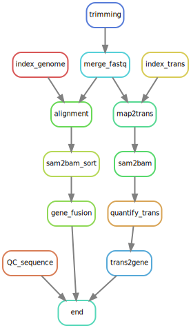

# Tutorial for ONTflow
## Overview of the workflow
ONTflow is a workflow for analyzing long-read sequencing data from Oxford Nanopore Technologies (ONT) sequencer based on *Snakemake* which enables the workflow reproducible and scalable. It is also based on *Anaconda* which simplifies the installation of all required tools and also ensures reproducibility.

The origin intention of developing ONTflow is to analyze in-house patients' sequencing data which is sensitive and all analyses need to be executed within [TSD](https://www.uio.no/english/services/it/research/sensitive-data/) which is a closed system, and Anaconda cloud is therefore not accessible. In that case, tools have to be prepared one by one manually.

ONTflow takes FASTQ files generated from the sequencer as input, and generated mainly **three** outputs: abundances of transcripts and genes, and detected gene fusions.

With `Graphviz` installed, the workflow can be visualized by
`snakemake --rulegraph -s workflow.smk | dot -Tsvg > workflow.svg`



## Installation

### For TSD users
Most tools are either already available on TSD and can be loaded directly, or already installed at a shared directory, as can be seen in the 	SLURM workscript file at `./scripts/workscript_nanopore_main_smk.slurm`.

But the R packages need to be installed by each user, since they can only be installed at personal folder as required by TSD.

Firstly, load the specific R with `module load R/3.5.0`, and then get into R by command `R`. Then install the packages inside there:

`install.package('hash')`

`install.package('tximport')`

But it's a bit tricky to install "stringr" which requires dependency "stringi". You have to install "stringi" with `install.packages("/tsd/shared/R/misc/stringi_1.4.6.tar.gz", repos = NULL, type = "source")` (more information here: [https://www.uio.no/english/services/it/research/sensitive-data/help/software/r/using-R.html#toc6](https://www.uio.no/english/services/it/research/sensitive-data/help/software/r/using-R.html#toc6)

Then you can install "stringr" normally:

`install.package('stringr')`


### For Linux users
#### Install Miniconda
Download Miniconda installer from here: [https://docs.conda.io/en/latest/miniconda.html](https://github.com/zhxiaokang/ONTflow.git)

Install it to your laptop or server.

#### Install ONTflow
Download the repository from here: [https://github.com/zhxiaokang/ONTflow/archive/refs/heads/main.zip](https://github.com/zhxiaokang/ONTflow.git)
and unzip it.

If you have Git installed on your machine, a better way to download the
repository is to use *git*:
`$ git clone https://github.com/zhxiaokang/ONTflow.git`

With that, you can easily keep yourself updated with the latest version using the command `git pull`.

Open your terminal in the directory of the repository ONTflow and run the following command to set up the environment:
`$ conda env create -n ontflow -f config/env.yaml`

Then activate the environment:
`$ conda activate ontflow`

But Guppy is not open source, and it is only available for ONT customers. For ONT customers, please download and install Guppy manually from the ONT community. And add the installed path to the environment:
`$ export PATH=/path/to/minimap2:$PATH`

### For Mac and Windows users
A Docker image will be provided later.

Tips for Windows users: For some Windows operating systems, Windows Subsystem for Linux (WSL) is available. To install it, refer to [https://docs.microsoft.com/enus/windows/wsl/install-win10]() and then follow the instruction for Linux users above.

## Setting up
The Nanopore sequencer generates a lot of FASTQ files, the most interesting ones are in folder `fastq_pass`. The FASTQ files are stored in folders named like `barcode*`. Creat a file named `barcode_index.txt` and list all the folders' name there (one name each row). For example:

```
barcode01
barcode02
barcode03
barcode04
barcode05
barcode06
barcode07
barcode08
barcode09
barcode10
barcode11
barcode12
```
In the case of Genome Biology group OUS, go to `config/config_nanopore_ous_p19.yaml` and modify these 4 parameters accordingly: `BARCODE_FILE`, `DIR_FASTQ`, `DIR_OUTPUT`, and `DIR_TRIM`. And for other users, go to `config/config.yaml` and modify the parameters accordingly.

## Run the workflow
### For TSD users
Go to the directory `script/` and run `sh runscript_nanopore_main_smk.sh` from there.

### For other users
Go to the directory `script/` and run `snakemake --cores 12 -s nanopore_main.smk` from there.


